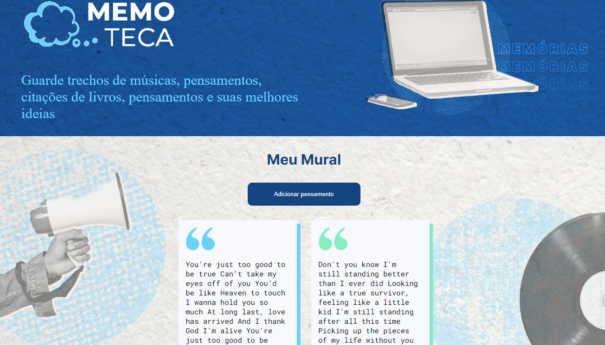
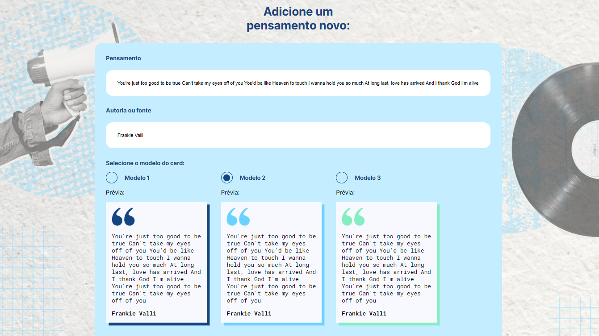
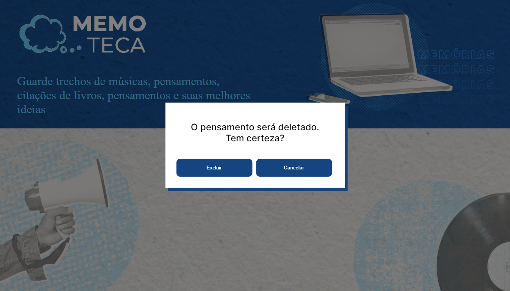

# Memoteca

# Descrição
Este projeto consiste na criação de um CRUD utilizando Angular 14  
Foi criada uma aplicação onde é possível o usuário guardar suas anotações, pensamentos, trechos de música.
  
Foi realizado na construção do projeto:

<ul>
  <li>Property Binding.</li>
  <li>Interpolaçao.</li>
  <li>Event Binding.</li>
  <li>Two-way Data Binding.</li>
  <li>Property Binding.</li>
  <li>Navegação dinâmica entre componentes.</li>
  <li>Injeção de dependência.</li>
  <li>Requisições Http.</li>
</ul>

# Layout do Projeto

  
  
  

# Tecnologias Utilizadas

<ul>
  <li>Angular 14</li>
  <li>TypeScript</li>
  <li>CSS 3</li>
  <li>HTML 5</li>
</ul>

# Autor
José Ricardo Chies Gonçalves

LinkedIn:
https://www.linkedin.com/in/ricardo-chies-087557216/

E-mail:
chies.dev@gmail.com

